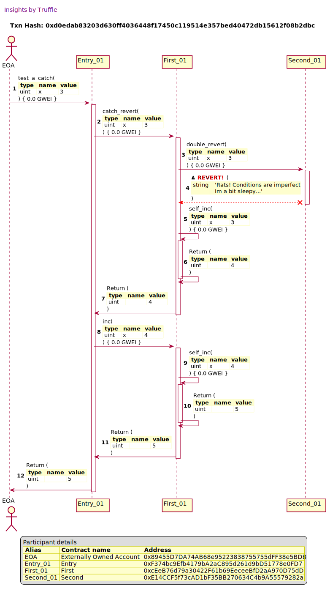
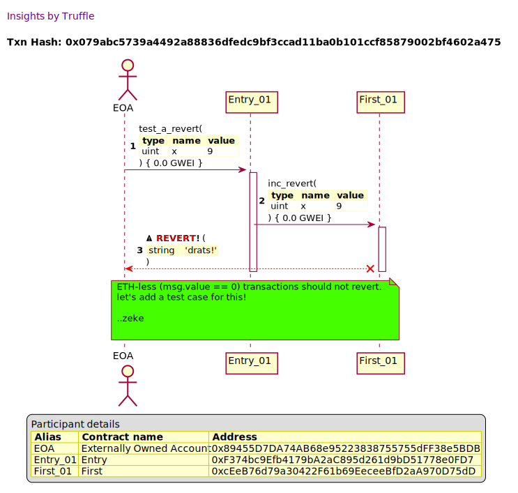

## Truffle Transaction Visualizer

Generate a sequence diagram for a ganache Transaction. The visualizer performs
a transaction execution trace to create a sequence diagram with decoded
parameters, return values, reverts and selfdestructs. This is all make possible
by the pioneering decoding work of the Truffle debugger.

## Commands


```
Truffle Transaction Visualizer

usage:
  truffle run tx2seq [options] <tx-hash>

options:
  -h --help                         Show help
  -v --version                      Show version
  -o --outfile=OUTFILE              Specify the output filename
  -s --short-participant-names      Generate short names for participants. This means
                                    <contract-name> instead of <address>:<contract-name>
```

## Use cases

The visualizer can improve current workflows and introduce new safeguards in
your current dapp development practices. It is a communication tool that
presents meaningful information across debugging, onboarding, validation,
auditing and documentation concerns. 

The visualizer generates a Plantuml document that by itself can be viewed in
your editor of choice, or rendered by a plantuml server. The plantuml document
can be annotated for different needs.

For example...

### Debugging

Getting the **Big Picture**. The sequence diagrams shows the debugger's summary
and outcome of a transaction that highlights **Reverts**, **selfdestructs** and
message calls between contract participants.

Studying a Sequence diagram of a transaction gives you context to reason about
contract interactions before diving in with other tools. You could even discuss
the diagram with your colleagues before examining code.


The following diagram shows the interaction between 3 contracts, `Entry`,
`First` and `Second` which shows one contract *catching* a revert that occurred
in another contract and continued processing. All without you stepping through
the debugger.


<details><summary>Click to view transaction overview</summary>



</details>

### Social coding review & collaboration

Plantuml sequence diagrams can be annotated for note taking or to give feedback.
The following diagram has an annotation to show how this feature can be
utilized. This can be useful in an educational or social coding setting.

In the example below, the reviewer notes that `ETH-less (msg.value == 0)
transactions should not revert` and makes a suggestion to add a test case to
cover this scenario. The reviewer only needs to know the problem domain and not
necessarily how to code or run solidity.

<details><summary>Click to view annotated diagram</summary>



</details>

            1. Inclusive review of dapp behavior with stake holders who are not
               solidity developers. [Show example of a scenario that non devs
               can discuss]
  - [ ] [Motivation](Motivation)
    - [ ] Communication: what does the debugger have to offer? debugger is an
          instrumented view of a transaction with useful data for communication
      - [ ] validating dev intent and code
      - [ ] auditibility
      - [ ] inclusive collaboration
      - [ ] Francis' points
    - [ ] Future vision
      - [ ] Use tooling to generate and categorize tests
      - [ ] Example of setting it up with task spooler and ganache
  - [ ] Examples
    - [ ] Local tests
    - [ ] Hackathon
    - [ ] Gloom
    - [ ] ENS
    - [ ] Balancer

## Todo

- [ ] Tests
  - [ ] Participants
    - [x] uses short participant names
    - [x] can add participants
    - [x] avoids alias name collisions
    - [x] tracks all participants
  - [x] Constructor calls
    - [x] invoked with no parameters
    - [x] invoked with a contract parameter
    - [x] invoked with ETHER
  - [x] CallRelation
  - [x] ReturnRelation
  - [x] RevertRelation
    - [x] can revert entire transaction
    - [x] can be caught
  - [ ] MessageRelation
  - [ ] SelfDestructRelation
  - [x] Deactivate

## Plantuml server

https://github.com/plantuml/plantuml-server

```
docker run -d -p 8080:8080 plantuml/plantuml-server:jetty

# prereqs on Arch

$ sudo pacman -Sy jre-openjdk-headless
$ sudo pacman -Sy maven``
```
