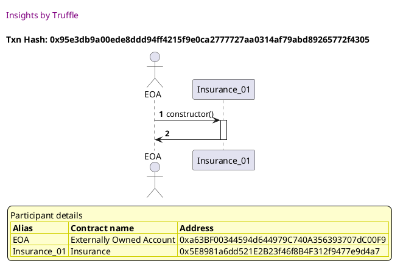
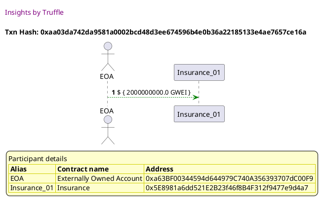
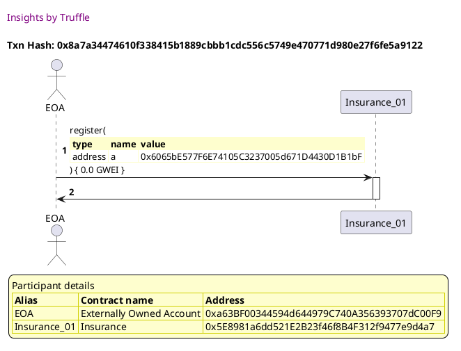
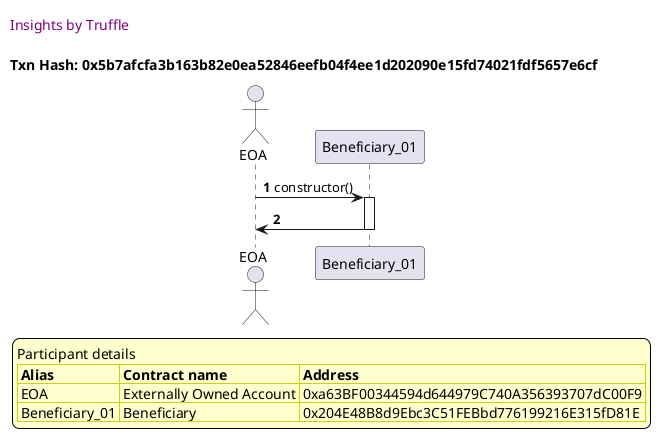
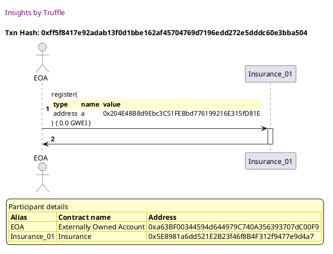
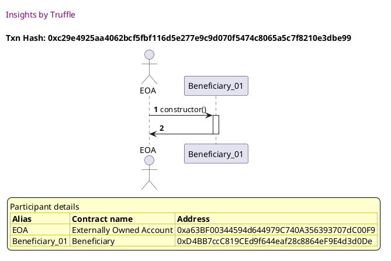
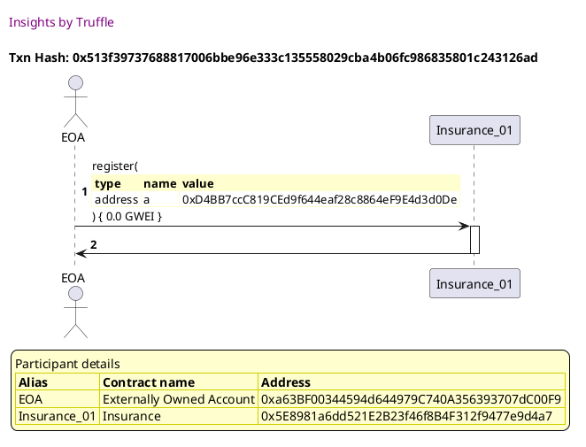
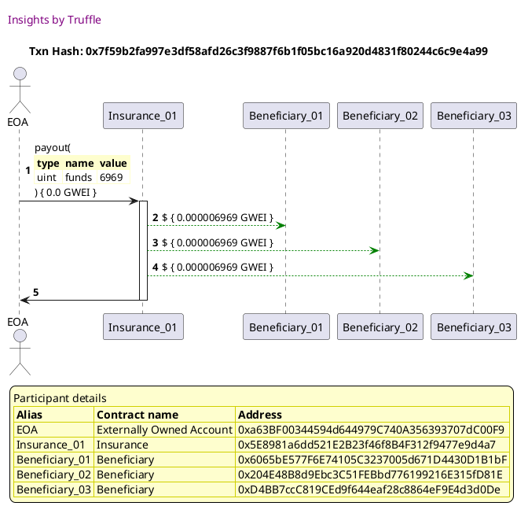

#### 0x95e3db9a00ede8ddd94ff4215f9e0ca2777727aa0314af79abd89265772f4305

[SVG :telescope:](https://www.planttext.com/api/plantuml/svg/NL9DR-8m4BtxLupePLVTQft4IJ1YKO4cwfvQgRrNGsn3LECWnz52j_lVTmWHWlhWZ_TctdoPiVise0_TrZA6NMXSjrrfpzhtsktGunQiNckd5bYzhttJERLiREFXfYpAObamDct3mUePWtvjD2hjuU_m17XiVFtHk81sRkkrsseNID64iq59v4bor_cTrLV4I_sX8H9dx1cLgjqQ8Zv0__fp-dD8WWtnVxksNcz22wi3lFhE6D9beGvMm-lUmIEscmdmlKnrebOIETTAZvLIKXWZuYWrKlCAuvnMd2Fo919eSeahDPPnbX9gHC9JHYsh0gLUFCq1MnZHEMBKjb1NzGwfL4gay-Wg_SQZtk8I637MUy3Tx0i1jxSJg1hN1jyT0tpxphuO75rEldSJOEmq9FPy4LhfWBLjsNGOrO-R1_x0EPzz_WAQ1IL3boKrsLCDu72hZy1SAQzRuiv-iy--FDhtGNk7rXxWwO_J2kPLHHyY4CNtc2MBalD4Y5GAbGaXSxdC1PydQPR89EUvMd9UoclXg_PSF7l9j1ZBSOIPKcaS5V4YJep8p7WXoYIAZHHvhgKIc9CarJvqWDtJJf_vFm00)

#### 0xaa03da742da9581a0002bcd48d3ee674596b4e0b36a22185133e4ae7657ce16a

[SVG :telescope:](https://www.planttext.com/api/plantuml/svg/NLB9Rjim4BtpAmPsZqrBYPHa1QuHsv6Qd1AW0NeeYc8iZcGXCcLG5Efi_zwfeXfsUU0oo-ERDoF4LUVH-NxN286zRss_sv0JtMDjz-Xm1mrLPCqAYyVAjRqrwxPf7KppBC_McH3ppZyrj10mh2sX8GSlunFWfdNrSsizDikchkoEh6V4qXy3SdQ-G-vxjs_epF6jVYO8zD5sZyRKje90ZgQtuPn_7ac8yVzRszNLrdUmUO87rvSbumfV-uRWuM3X1hlj9SW3ebG64nqQJADPW5BAS5COFJEAA4vqbCORJNAZOWp3O1O5If56Ik8eAIY8KR1aXMVgsTqIi8C9dnF1ilcwgFV8fJAHtg4jw9SCXeXJmqI88GCkVamhHsH_NYp-Yu1B-00l4Cf_wvE4hz-pMovSl3T6t9zyPyXZtNHYFhRdu_HQNdFMulKBiFvCW2zh5jOnRx2uex-6fJ6EElOTynQlGqcy7pmvYqtp17U_BHbO5WKFWMSNonUhLIwbqYoKDh7MQPAk4osNAefLgXAPcBMKUNeEV2R9oNE0ZB9Poes8ZOd280jNeIfrNCvMEbT1MAOwIIWr6XE6vDf71SGLxpp0Vm00)

#### 0x4d193ca9eee38bc2e044bd5cb134d07f51d7e9c72b759da301921c1879602c17

[SVG :telescope:](https://www.planttext.com/api/plantuml/svg/PL9HRziW47xdLvpIbqrTDOYnAL4MDN5iTK-jjBvF671YbU08Ootfkl--YsD5o-e7CDztzt7t7OGyT565sEyS8QgFhUztbGsaUstyNWMr0sStrfkLqg-RqFRUvArh0zoKHLda1I7pBXwTNH0OlgrLnWRuFHu17jlGlBK-AhTqpSRlh8-eMCTBG8daMNBVXxspLyIFviq2unViMHdJ-0qmEa9_Xdt-TIo2ZFT_zrspsSOEgYEyXBwkKPV49ZeBBmSFZwhRpe0Uk64oqKfQQvFxIayjvRmogQvOmWqLTSgCi5ABQILIQLH2cPmopUw5pEXKCq7GCXsnzE9f2Qg32UuJWhR5HZTxXQskhBSr7bGu_gHiYBc69eGCMN2t-431xUqCTEkx6FhJDPy-amyXfxHp_jqC23aFYpp_KuAnKJMk8_DnP5zkrdHDALsyVmES2PQ4FpcQ7R0Ny6fdJy3Ic60xv2vvY_UXJLmFqGQld3l2qozl3IorneSHaQ87bIMhajA4yrHoat4kXSm5fyiapHAP22fCJcafhuN_i-aA66GpcgLLaGfHPeNWZAPvCaKncffCi3Nd2Lsp5QjAbCN-HnV80wxuiFy2)

#### 0x8a7a34474610f338415b1889cbbb1cdc556c5749e470771d980e27f6fe5a9122

[SVG :telescope:](https://www.planttext.com/api/plantuml/svg/NLDjRvim4FxkNt7AlcpgkjbWOuYog7c1jPzQQPNsfT9ai4bGYOcCsP8s---x41QbHS9tlZUUU-uWvARrolbkKnEYEj_ORfCRHzhdocwLKnkepSfOFLV5yyerdTMBfcuSVCZIB5saX4nQlw_Db43_h8tIni7hS0MuRLprqbYlwbbThUp6M8yLItyEoD1vAhdjtBOsRnm_gXS3Z9zj3qhhogw0qS7qjvUJhmC8Cdp_phRLQkrRoFVmwBgonBh4LxusyBYpSAlQzHZeBbPIXPnB7Z5QXc7CcSXP72T5dkUiq8KGKI4aJmoNL4gcavYQG9PHQOHAM10GfApm23szdu5gOOHoH90sNnNLLc6h2AHpoXRc5sLznALXH4YV0TVJTmwukXg3CwkgzSPzVB9FP38G_dcGqyCtyFkj0PHMRNhvMzKTAiVm0o1JphGje8OltKKq4dagfCoYL796nI8CGacfq95aIyv3kcHpbcUd_4_m2lGBXUy_qpia-Hsw8zuJyEin47BQ4F9mqRSsNbLrUm5xIPUKqYDiN0Ha0fK5JjWXWUS6Plynd_EcXvvRF7V8X5LrlOVxFzPec1K5RgFlUrDHECyenL6AXEk8yqGc2ydfB1HHc62NKYyepPAtXT_CvkBQbnHfdCHCHLgBWAN1F0XB7fNnd6SX2yg4IsaIpPN4ajZxm02vmHF_f7y0)

#### 0x5b7afcfa3b163b82e0ea52846eefb04f4ee1d202090e15fd74021fdf5657e6cf

[SVG :telescope:](https://www.planttext.com/api/plantuml/svg/PL9HRvim47xthpYbBvkwQWOCX2YBcX1GzzHAwtjby3b1TKnaZ9PqtN_VXQ1eQNcmyVVTVRxxpepTTruwt-yCOxBthUrt5JhMlJPsBvtSWS4DMhMIzUl6jRrLUMjQ1pTbKHPvmTYyyqU32mR3jqMfqC6VyGZmqBhchRLUcgLfDdQ7rfEYzfU0aiYpvBvtUuDNnA_c3I4G5-n9AjNO3GHyXFuE-_pxM0GRx_zfksQpzHrKHtXslTQaotpZ3SBpmSA3xBOpu8UuIgMkjOog88cgQOWSPHnEHOAeAowqG0nKo4EUSGnYhLB1mq0h7ITnYacj6LbMUogzU5o2x612-uIHRRwfcxsaLbTeKTD1kkCB3uQOQsZ2s905TujF5DpUpg1kRUTTVxhcorVsAUIKTiw_cm5Zvs6nf_zAKEXbOpes7qVsxMRDrvppnViFe9bGIVIJazcEUW4hTtW2baevx8Yxv2tUXpPfFNXqLXfpXCVV5XKiwveUXYUA7sGIhKhE8o7YJAX4Y2pDSl9j6SL9b4KfJrNEUPbT2t-mwGeOP4Ck2Z5TJLLML7MKnq5Ph2gLfacGPM6G516DPpqD2fAb_aSNs3sjzB3_0G00)

#### 0xff5f8417e92adab13f0d1bbe162af45704769d7196edd272e5dddc60e3bba504

[SVG :telescope:](https://www.planttext.com/api/plantuml/svg/NLFVRvim47xtNt7ANZPrtMmm64TPrFo0jK-jj4fxgJGPR19KOY9ZjgJD_lTT28lI8k4x--u-lljy47BJUkLyjwa9KPrlRBV9ZIFjSsMtogaDr6Pbh9whuddbcixgHLCt3ZvaQPOkKa8chT_NPagWVzP6QUFWTTW2t3QkUcciL_MihbPsOwn7nDAV4p8CdY2tdTlMvatWH_LYWF7psOFIkh8hO7Gu-jlRoTU111c-VsVRQhNsBUHxU7HTMI8kyPMl3JpkBDogTZq6kYlBg4mu4qO6IgkSXINLBCyDYmDLyaXGBcAf1PEnqJeGWOcqraLCJPZdAgASe6I5H-hf_GnK2oEq8uAo-QgejWfRHIATKxOmloZhCouFHeJq5N0zVHU0gwinEBEgMc_SnoVxH2Q3u9y7Epry0x_V6a1hrQQtlrNTeNDCFm0gvKpR0dhuqbr0USgJUQ9bcXVX8c9PEi-r436JCc1n6hAeN2OiFTL_WbUWNoXy_vdUeSZls1tvdeXVZu6GquIGXuk-jV6ggjiBsakwf9GUQUCWe1BeBF267GfuRc3sd_EvRdhejSLrXqfOLTTxkFzZZOPPKU0q-hut5OVpZDAGyqXo7NCkXLm8JcTX58So55Je1QMPV0lyvcukjZrab2OoOIhMEWfO6io3iEHncSnv5hAWb5pWq6Yk149YxuC2v0PN_9F-0G00)

#### 0xc29e4925aa4062bcf5fbf116d5e277e9c9d070f5474c8065a5c7f8210e3dbe99

[SVG :telescope:](https://www.planttext.com/api/plantuml/svg/PL9DRzim3BthLn3fPKDNJBRb3mLPqCInqPrQOBqNYaGdHXqva6KiwRh_FiOnWgNrGRBuoAV7Hp5sttdbVBzh65EzRss_MwDZtMjjzygf7JIuGMkMIhzkNDjRaxTDw-2cBCeYBnYRTVxOu9p1y6rH6NJmPpm2FBIkVckjLysYgJTsXzOJO-Kl2IM1Pyfzx_ODNW6_wZU4G5nYJygOscuWu6Fexx3FleyYs7Z_JzlLcwtlO7s4PzTN5V4oN_i6uVbWuK5rsodmWmub2Xd6IWcUX6jTnTMw2eB4n1YcAKej3Kzv5OjKw8mdiOfrMcLXm34oQvIIaMNQa_JYSG6gWmdj4qQs-LhNUqMjBj5YHGVbZYyy67AkGnF6XYguct-2uFPs2hgrdNVzwPelNzcdb5FPkVvk2eoTXyMU_fDWqAkwwTXi7DctcnLVSSxdxp-0PaAIw2Sdintr0bRjy1HO6EEm8-nIDtyVsgJruD5PrJH7UFnjqS12QteOdY1-K4cqB3cFX8YbC8aGCfLvAlWYYfD8HYbFJSvvAQ-9FzXq5HXeLsAvJBNEiq3cXP4L4QEgmandMIAmb8KmaU4haiwe_z45TayhFUn_)

#### 0x513f39737688817006bbe96e333c135558029cba4b06fc986835801c243126ad

[SVG :telescope:](https://www.planttext.com/api/plantuml/svg/NLFVRvim47xtNt7ANZPrtGmsO5TTr8J0sgTMMgMzL9eSswIen4J6R4cR_U-xK1QbHS9tlbzyzzr1o5KNb0_zkY54zQ5r_NffFUcUQhTHNgsXiIlhp5pffvLlUsVojcazV2YBiiWBGYwxi6libC3mF5fbh8UNyGfmtVhwkNL1DREcNhcrTG4hLk4OKABpjUIczvl6ld7yg9yjHFnekrF6r6u54HrDVmTv-NK4GSRltxYkNZs63fOxkFTzLM5T4khGMBZVEhXMtUC5q6qIiOh9Z6Mf42BAA4sNIojJonZJ4KkIHD1OwgNYIvfMMefKC3H5EkOiYbDb25Ac0q8lRcUWEfYWd12aBTIwtYXi5O7qNZbjVz5eY3WrJ0WPCk1y-iu1PsSNuEsgxeBr7n_S0xaS2Vyyokd-6uJTnW9AfzQ3_AsQ7fL3-1wGAM-x3b33bsuNV3xFjCv59FF2o2hbtAeg5bg8bDjI5jmmGnTZ_YTu0Vg5mlUVnGsI_0xT0UyhyFCB8EHrGyZTIT_61bKttGdi1LrGIW-mSH6G2LHodB170eyDpFvZFkPDzmEtU6wH2QUQPWUtVvmrCDCQjp4ClQcKpKjA6UU9v0OxavdCCqvdB4cPP1dDJ4vfATyMVZERa-jGCYc4595AZKdYg8ZdCQjuMeavBt7qbUHPPgNXAiEIsFl80Bd24_-aVm00)

#### 0x7f59b2fa997e3df58afd26c3f9887f6b1f05bc16a920d4831f80244c6c9e4a99

[SVG :telescope:](https://www.planttext.com/api/plantuml/svg/hLHTRzCm57tthx0s7a1ZuA_OSJKgcZHXUzea9l70479YkukMkbK-eDtAVyTDGzLsKwL9-C7NlZu-lZdttW3mkMvKrRJJ4W3LDZFNJZDJWVgXS7DLgIaipSGu7QdyOLBDMgVZMJchu6cQf4cS071HDylI307inhrHsbJmgTz2U3chYiUPQrGvAek9cnhNU4RRR06fFznGpjjgNfgzWw_5eu6ORNqtIkl2JI16lUjFPoy-za60_lqhLnUJ-wQ6sHBULgsrdXSqHLCQUBjmy5BLzmE85i86CYDMIIaCrJO8bTM4vzJAC1IMPzYY8CinLv8WpKAAROW8OpdFfM7-5l2IvOqFFRaUGLN34szFW9UjAV9Yhlod-a3QIhdS_4IuG-mwzg6HSSRwZQgM_y3xhYDmyXnEZi3fSpWz0Q0B7vuF3wA4PsS3E5VBMTkylNDtuABF_VlU3bUVOBES6-YjKzFE_b9bwnTh-0gsXGzW1QqldjfRBhdS7Bs3Jn1zGF3Bj-JAf_BWsVFlfvFA6FTZ7T615700tsmkhqV7-5eIyZz8w2j8Xh0N-7m00TYq5RZPoP4sZIhAUaVWCHfxqhN0ldjyplmYzcrH-QhRIZtIkZArFzlU6wwwWlJpeZ6LKsMvXDU_dT5mbEU-XTV9G0l5QPGYH1aB9DESCIbaB1WQqO1JIGKIEaOebVl4UmMzi-qeWoIK8LPSwu3WX4I4MiPj6B6KOc8b4y98pPJOfpme_3r7HyiH3x8a42BbYM0O1J4bFZuKQ2xmc36AnZZ2MNg4bhn0In1BM1Y5MYPPJkC0fqcKQI4ubf9Wdb0Ss768aoEqz0NQCOiYaUTnY6MSQ6cziaPP4kPXo9b9PS8qrMZi5GE-0Feo09_zxF_1Vm40)

